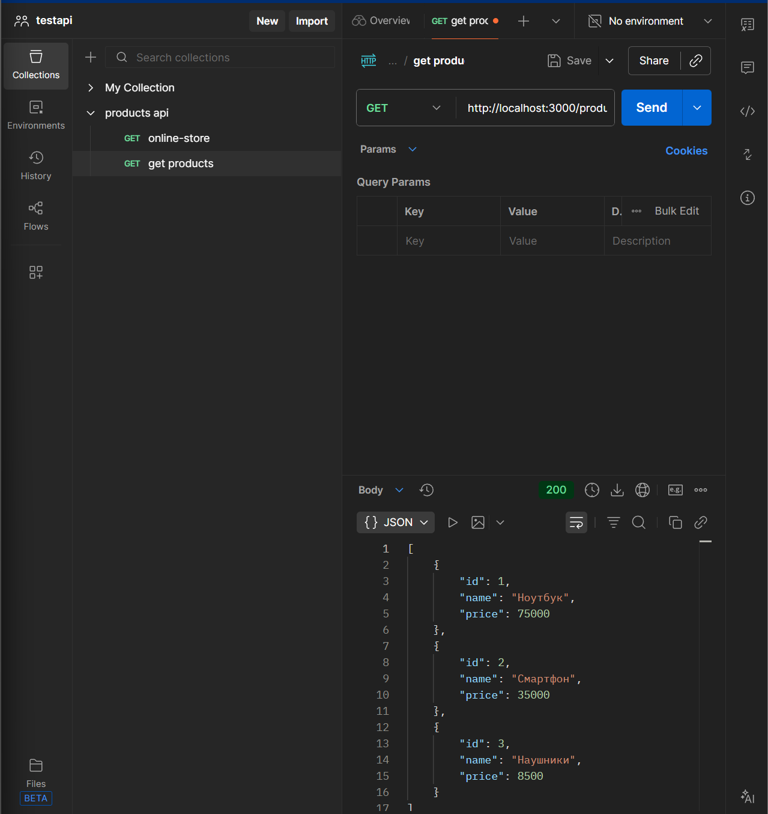
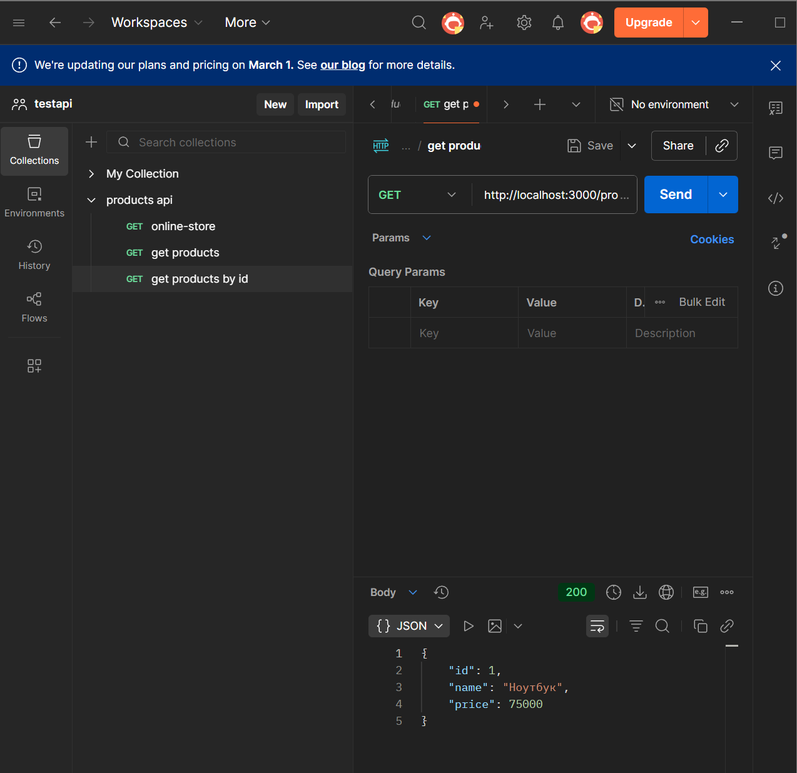
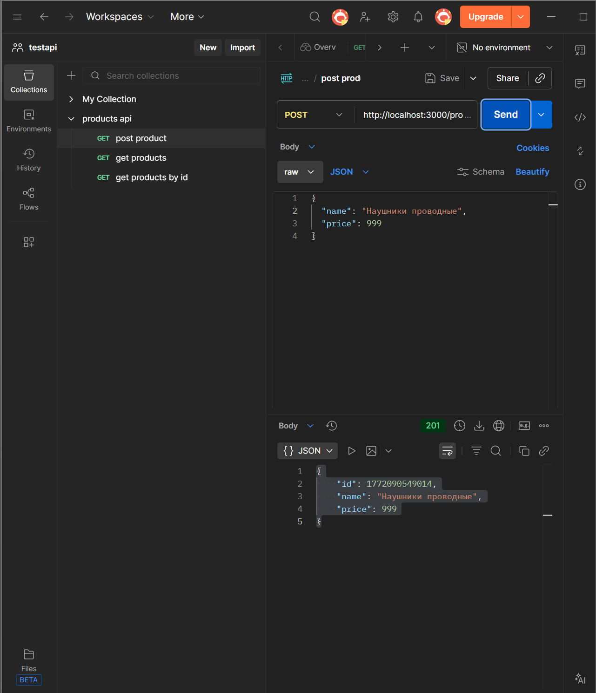
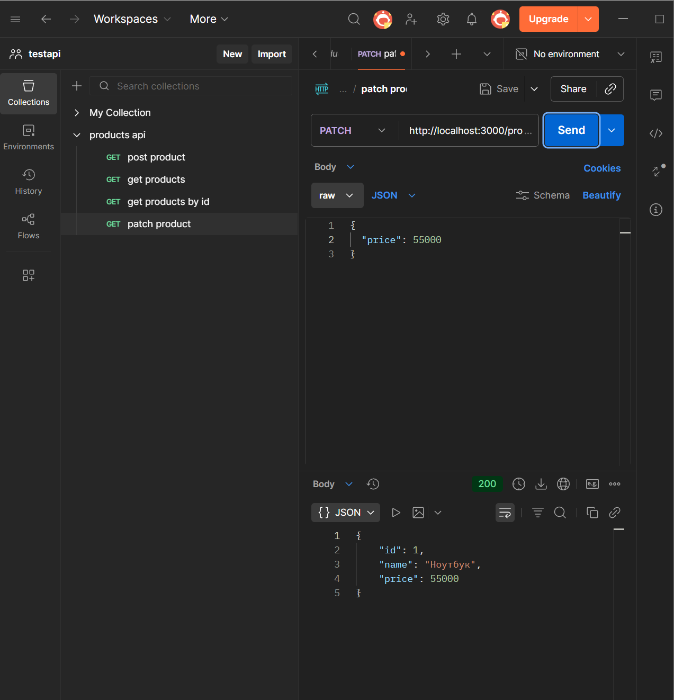
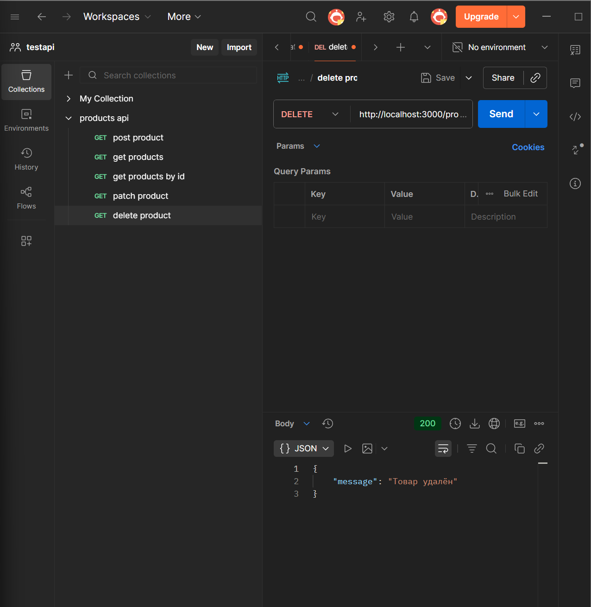
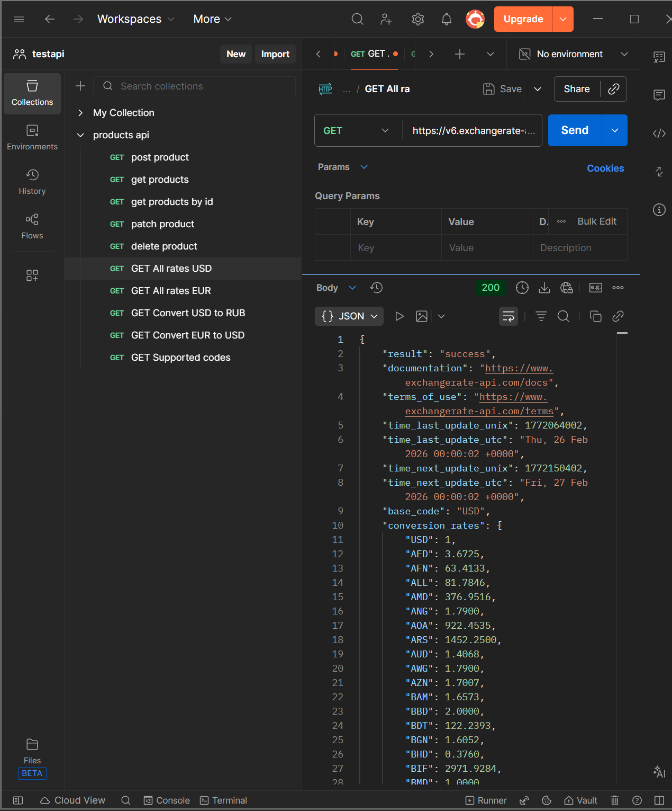
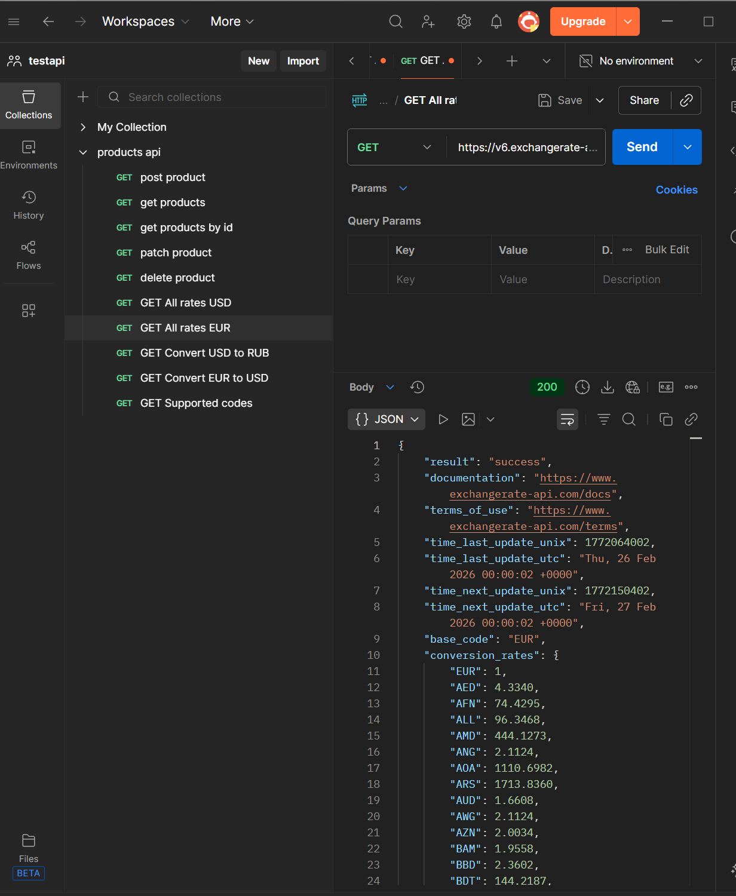
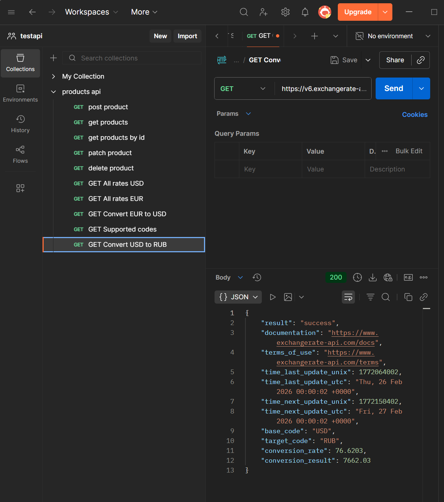
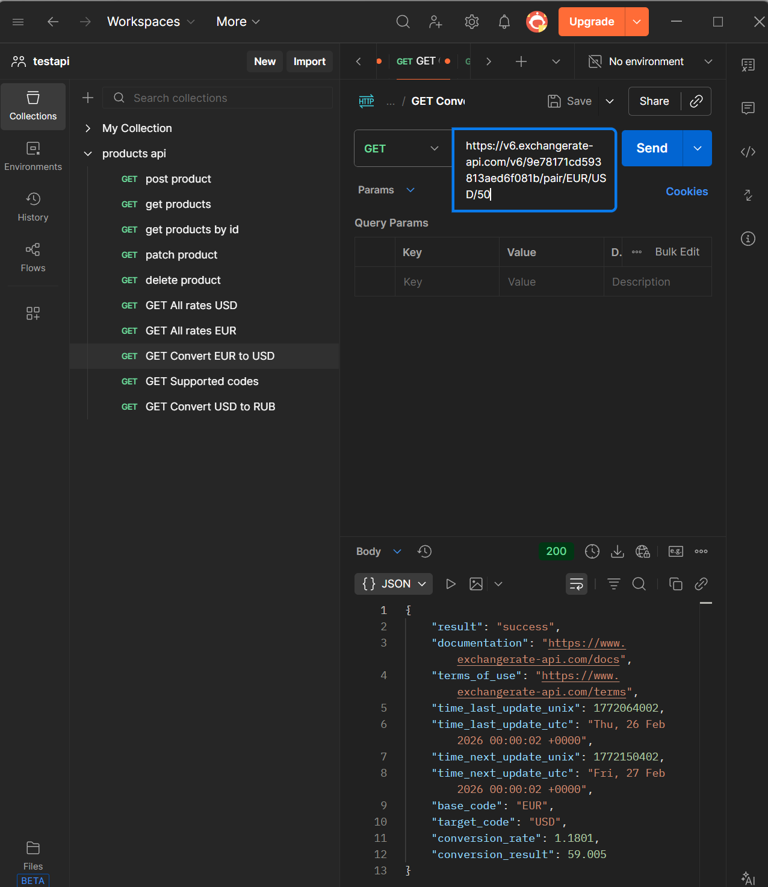
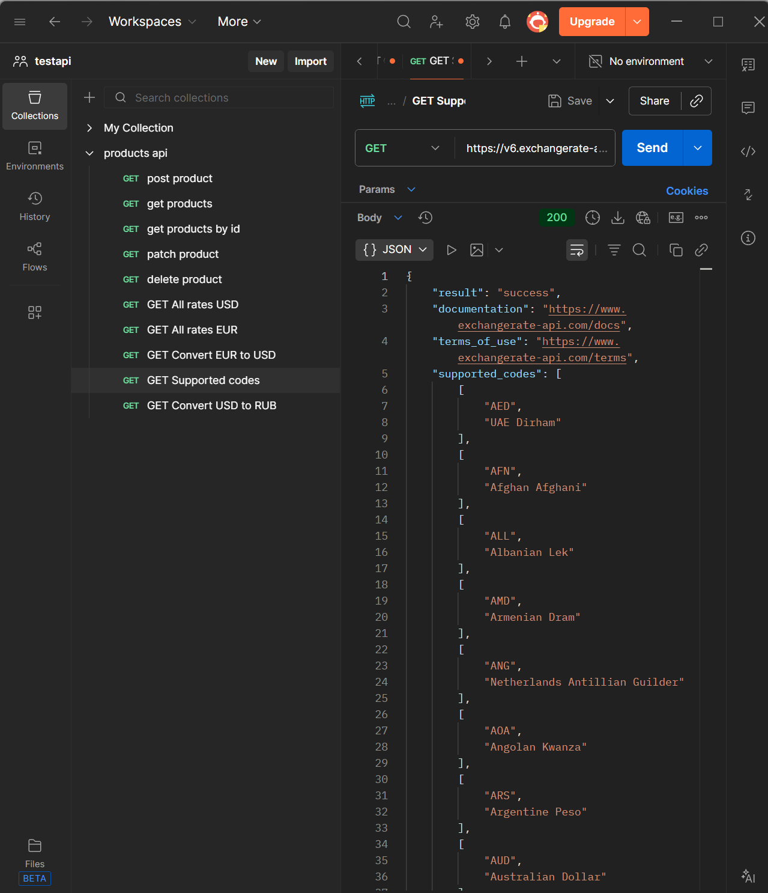

get - все товары

get - товар по id

post - новый товар

patch - изменение цены 

delete - удаление товара

get - все валюты относительно доллара

get - все валюты относительно евро

get - 100 долларов к рублям

get - 50 евро к долларам

get - список поддерживаемых валют
